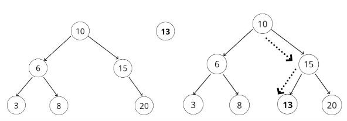

So, what is a tree?

Tree is a data structure that consist of nodes in a parent and child relationship. It is a non-linear data structure made up of root, parent, child siblings, leaf, and edge.

There are many application of tree all around us. We can see it in HTML DOM, network routing, computer file systems, artificial intelligence, etc.

Binary search tree

One common example of tree data structure is binary tree. A binary tree has a parent nodes with at most two childrens. A binary tree tree is unsorted.

A sorted binary tree is known as a binary search tree. Children node to the right usually has a value greater than the parent while children node to the left has value less than the parent.


The following is the code to instantiate a binary search tree.

```
class Node {
    constructor(value) {
        this.value = value;
        this.right = null;
        this.left = null;
    }
}

class BinarySearchTree {
    constructor() {
        this.root = null;
    }
}

let tree = new BinarySearchTree();

```

Populating Binary Search Tree is pretty straightforward. For every possible new node value, compare it to the current node value. Move to the right if the new node value is greater than the current one and move to the left if the value is less. Repeat this process until there is an empty position.

Let say we want to insert node of value 13 into the BST below. What happen is we will compare the value 13 to value 10. As the value is greater, we move to the right to compare it to the next value which is 15. Node of value 13 is less than 15, and as there is no value to the left of 15, 13 will be inserted there.



To insert a value into the tree, we can either do it iteratively or recursively. The main idea is the same for both method.

First we create new node to store the new value. Then, we chek if there is a value at the root. If there is no value, we can assign the new node to the root. After that, initialize a current variable that we use to store the value of the root. This is our starting point. All the new values to be inserted has to be compared to the root value first. If the new value is more than the current value, we can step to the right and if less, we can step to left. Do this several times until we find a place for the new value.

The following is the code to insert a value into the tree iteratively.

```
class BinarySearchTree {
    constructor() {
        this.root = null;
    }

    // Create a new node.
    // Check if there is a root, if not - the root now becomes the new node.
    // Initialize a current variable and store this.root in it.
    // All the code after this have to be in a loop (while loop)
        // Check if the value has been inserted. A binary search tree does not need multiple copy of the same value.
        // If there is a root, check if the new node is greater than or less than the value of the root.
            // if the value is greater,
                // check to see if the there is value to the right.
                // If no value, add the node to the property, otherwise move to that node and repeaart this step
            // if the value is less,
                // check to see if there is value to the left.
                // if no value, add the node to left property, otherwise move to that node and repeat this step

    insert(value) {
        var newNode = new Node(value);
        if(!this.root) {
            this.root = newNode;
            return this;
        }

        var current = this.root;

        while(true) {
            if(value === current.value) return undefined;
            if(value > current.value) {
                if(!current.right) {
                    current.right = newNode;
                    return this;
                }
                current = current.right;
            } else {
                if(!current.left) {
                    current.left = newNode;
                    return this;
                }
                current = current.left;
            }
        }
    }

}

let tree = new BinarySearchTree();
tree.insert(10);
tree.insert(6);
tree.insert(15);

```

Finding a value from the tree is pretty much using the same idea. For the value that we want to search for, compare it to the current node values. If the value is higher, move the right, and left otherwise.

```
class BinarySearchTree() {
    constructor() {
        this.root = null;
    }

    // Check if there is a root. If not, we are done searching
    // If there is a root, check if the new value is the one we are looking for. If yes, we are done.
    // If not, check to see if the value is greater or less than the current.
        // if the value is greater
            // If there is no value to the right, we are done
            // If there is, move to the node and repeat the above steps
        // If the value is less
            // If there is no value to the left, we are done
            // If there is, move to the left and repeat the above steps 
    
    find(value) {
        if(!this.root) {
            return undefined;
        }

        var current = this.root;

        while(true) {
            if(value === current.value) return current;

            if(value > current.value) {
                if(current.right) {
                    current = current.right;
                } else {
                    return "Cannot find value.";
                }
            } else {
                if(current.left) {
                    current = current.left;
                } else {
                    return "Cannot find value.";
                }
            }
        }
    }
}

tree.find(10);
tree.find(6);
tree.find(15);
```

With the `insert` method above, you can start populating your binary tree and then try search for the inserted value with the `find` method.

Time complexity of Binary Search Tree (Big O)

On average, BST has a time complexity of O(log N). The simple explanation for this is that, everytime we add or find a value, the act of moving from node to node effectively cutting the data set in half.

So now we have a fully functioning tree, how about if we want to traverse it.

There are two ways of traversing a tree; Breadth-first Search (BFS), and Depth-first Search (DFS).

In DFS, we will visit every sibling nodes first before moving on the the children.

In BFS, we will be moving downward to the depth of the tree, visiting all the children, before moving on to the siblings and their children.


The following is the implementation of BFS.

```
class BinarySearchTree() {
    constructor() {
        this.root = null;
    }

    // Create a queue (from an array) and a variable to store the values of nodes visited
    // Place the root node in the queue
    // Loop for as long as there is a value inside the queue
        // Dequeue a node from the queue, and push the value of the node into the visited array.
        // If there is a left property on the node, add it to the queue
        // If there is a left property on the node, add it to the queue
    // return the visited array of nodes.
    x
    BFS() {
        var node = this.root;
        var queue = [];
        var visited = [];

        queue.push(node);

        while(queue.length) {
            node = queue.shift();
            visited.push(node);

            if(node.left) queue.push(node.left);
            if(node.right) queue.push(node.right);
        }

        return visited;
    }
}

tree.BFS();
```

There are three variants of DFS, pre-order, in-order, and post-order. These affect how the we traverse the tree as it will output different order of node values of the BST.

A pre-order traversal will output the root or parent node, then the left node, and then finally the right node. An in-order traversal will output the left node, then the root or parent node, and at the end the right node. A post-order traversal will output the left node, followed by the right node, and finally the root node.

Here is the BST from the first picture in this article.


A pre-order traversal will return [10, 6, 3, 8, 15, 20]. An in-order traversal will return [3, 6, 8, 10, 15, 20]. A post-order traversal will return [3, 8, 6, 20, 15, 10].

The following is the implementation of pre-order DFS.

```
class BinarySearchTree() {
    constructor() {
        this.root = null;
    }

    // Create a variable to store the values of nodes visited
    // Store the root of the BST in a variable rootNode
    // Write a helper function which accepts a node
        // Push the value of the node to the variable that stores the visited node
        // If the node has a left property, call the helper function on the left property.
        // If the node has a right property, call the helper function on the right property
    // Invoke the helper function with the current variable
    // return the array of visited node values

    DFSPreOrder() {
        var visited = [];
        var rootNode = tree.root;

        function traverse(node) {
            visited.push(node);
            if(node.left) traverse(node.left);
            if(node.right) traverse(node.right);
        }

        traverse(rootNode);
        return visited;
    }
}

tree.DFSPreOrder();
```