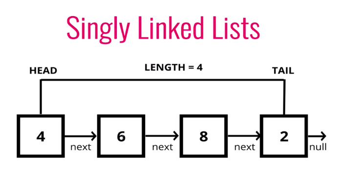

A linked list is a data structure that have a head, a tail, and length property. It is consists of multiple nodes which hold values, with a pointer to another node or null values. In short, a linked list is a bunch of nodes pointing to another nodes. A linked list has no indexes, connected via nodes with a next pointer, and random access in linked list is impossible. In ordert to access data in a linked list, we have to traverse the list to find any one element.

Following is the simple comparisons of List and Array. I put it in a table for easy viewing.

|Lists|Arrays|
|---|---|---|
|No indexes|Indexed in order!|
|Connected via nodes with a next pointer|Insertion and deletion can be expensive|
|Random access is not allowed|Can be quickly accessed at a specific index|

<br>

Singly Linked List

In this article, I will write about Singly Linked List. Singly Linked List or SLL is a one directional list. An example use case is when dealing with large dataset where we need to constantly add or remove data from the beginning or end of the data set. Following is the basic codes to initialize a Singly Linked List. 

```javascript
// a linked list is made up of nodes
class Node {
    constructor(value) {
        this.val = value;
        this.next =  null;
    }
}

// a class of Singly Linked List
class SinglyLinkedList {
    constructor() {
        this.head = null;   // initialize head
        this.tail = null;   // and tail to null
        this.length = 0;    // and length to 0
    }
}

let singlyLinkedList = new SinglyLinkedList();
```
As you can see, we have two classes. A `Node` class and a `SinglyLinkedList` class. The `Node` class will be used to instantiate a new node which will hold the data, together with a pointer to the next node. The `SinglyLinkedList` class meanwhile will store the head node and the tail node together with the total length of the list.



Right now, we can only initialize a list. What good can it be if the list cannot hold any data?  

<br>

Push and Pop

We can create a `push()` method to add a node and populate the list. By default, all nodes will always be added to the end of a linked list. `pop()` meanwhile is a method to remove a node from the end of the linked list. Push and pop. Get it?

Following is the code together with the methods to add and remove nodes from the list.

```javascript
class SinglyLinkedList {
    constructor() {
        this.head = null;
        this.tail = null;
        this.length = 0;
    }

    // The function should accept a value
    // Create a new node which store the new value
    // If there is no head property in the list, set the head and tail to be the newly created node.
    // Otherwise, set the next property on the tail to be the new node and update the tail property to be the newly created node.
    // increment the length by one
    // return the linked list
    push(value) {
        var newNode = new Node(value); 
        if(!this.head) {               
            this.head = newNode;       
            this.tail = this.head;     
        } else {
            this.tail.next = newNode;   
            this.tail = newNode;        
        }
        this.length++;                  
        return this;                    
    }

    // Return undefined if there are no nodes in the list.
    // Set variable currentNode to this.head and variable beforeTail equal to the currentNode.
    // Loop through the list until we reach the tail end of the list while(currentNode.next)
        // Reassign beforeTail to currentNode
        // Reassign current to current.next
    // Set this.tail to be beforeTail (if our code above is correct, this will be the node before the tail end)
    // Set the next property of the tail to null (effectively deleting the old tail)
    // Decrement the value of the list by 1
    // return the value of the node removed (the pop() value)

    pop() {
        if(!this.head) return undefined;    

        var current = this.head;            
        var beforeTail = current;           
        while(current.next) {              
            beforeTail = current;           
            current = current.next;
        }
        this.tail = beforeTail;            
        this.tail.next = null;              
        this.length--;                      

        // if no item left
        if(this.length === 0) {
        this.head = null;
        this.tail = null;
        }
        return current;                    
    }
}
```
<br>
<br>

Shift and Unshift

Singly Linked List also has a way to add and remove nodes from the beginning of the list. We can call removing the nodes from the front as `shift`, while adding the nodes as `unshift`. Following are the codes for the `shift` and `unshift` methods.

```javascript
class SinglyLinkedList {
    constructor() {
        this.head = null;
        this.tail = null;
        this.length = null;
    }

    // if there are no nodes in the list, return undefined.
    // Store the current head property in a temp variable
    // Set the head property to be the current head's next property
    // Decrement the length by 1
    // return the value of the node removed
    shift() {
        if(!this.head) return undefined;

        var temp = this.head;
        this.head = this.head.next;
        this.length--;

        // if no item left
        if(this.length === 0) {
            this.head = null;
            this.tail = null;
        }

        return temp;
    }

    // Create a new node with value passed to the function
    // If there is no head property, set the head and tail to be the newly created node.
    // Otherwise, set the newly created node's next property to be the current head property on the list
    // Set the head property to be the newly created node
    // increment the length of the list by 1
    // return the linked list
    unshift(value) {
        var newNode = new Node(value);
        if(!this.head) {
            this.head = newNode;
            this.tail = this.head;
        } else {
            newNode.next = this.head;
            this.head = newNode;
        }
        this.length++;
        return this;
    }
}
```
<br>
<br>

Get and Set

`get` method is for retrieving a node by it's position in the linked list. `set` method is for changing the value of a node based on it's position in the list. Following are the codes for `get` and `set` methods.

```javascript
class SinglyLinkedList {
    constructor() {
        this.head = null;
        this.tail = null;
        this.length = null;
    }

    // Function should accept an index value
    // If the index is less than zero or greater than or equal to the length of the list return null
    // Loop through the list until we reach the index and return the node t tht specidfied index.

    get(index) {
        if(index < 0 || index >= this.length) return null;

        var counter = 0;
        var currentNode = this.head;
        while(counter < index) {
            currentNode = currentNode.next;
            counter++;
        }
        return currentNode;
    }

    // Function should accept a value and an index value
    // use the get function to find the specific node
    // If the node is not found, return false
    // if the node is found, set the value of that node to be the value passed to the function and return true

    set(value, index) {
        var foundNode = this.get(index);
        if(foundNode) {
            foundNode.val = value;
            return true;
        }
        return false;
    }
}
```


